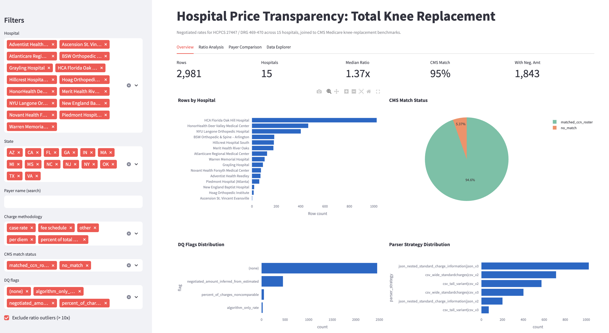
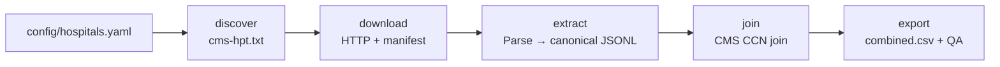

# Hospital Price Transparency Intelligence


Hospital MRF data is legally required but notoriously fragmented — inconsistent formats, vendor portals, and opaque rate structures make it nearly impossible to compare at scale. This pipeline automates the full lifecycle: discover MRF locations, download files, parse CSV/JSON layouts, normalize to a canonical schema, and join to CMS Medicare benchmarks to produce a comparable commercial-to-Medicare rate dataset.

**15 hospitals · 12 states · 2,981 rows · end-to-end: discover → download → extract → join → export**

---

## Table of Contents

- [Public Dashboard](#public-dashboard)
- [Quick Start](#quick-start)
- [Pipeline Overview](#pipeline-overview)
- [CLI Reference](#cli-reference)
- [Output Layout](#output-layout)
- [Triage Tiers](#triage-tiers)
- [Understanding the Data](#understanding-the-data)
- [Known Limitations](#known-limitations)
- [Development](#development)
- [Project Layout](#project-layout)

---

## Public Dashboard

An interactive Streamlit dashboard for exploring `combined.csv` — filter by hospital, state, payer, and charge methodology; view ratio analysis charts; download filtered data as CSV.



> **Live URL:** * hospital-price-transparency-intelligence.streamlit.app/(#https://hospital-price-transparency-intelligence.streamlit.app/)*

**Run locally:**

```bash
make ui
# or: streamlit run app/streamlit_app.py
```

After a fresh pipeline run, refresh the dashboard data:

```bash
make snapshot-ui-data
```

---

## Quick Start

**Prerequisites:** Python 3.11+, pip

```bash
python3.11 -m venv .venv
source .venv/bin/activate        # Windows: .venv\Scripts\activate
pip install -e ".[dev]"

# Run the full pipeline (all 15 hospitals)
hpt run-all
```

Or via Makefile:

```bash
make install-dev
hpt run-all
```

Outputs land in `data/processed/combined.csv` alongside `qa_summary.json` and `export_metadata.json`.

---

## Pipeline Overview



Each stage is **idempotent**. Checkpoints (keyed by manifest SHA-256 + extractor version + schema version) skip re-extraction when upstream bytes are unchanged. Per-hospital isolation means one failure does not stop the rest.

---

## CLI Reference

```bash
# Full pipeline
hpt run-all                                        # all 15 hospitals
hpt run-all --hospital hoag-orthopedic-institute   # single hospital
hpt run-all --tier 1                               # Tier 1 hospitals only
hpt run-all --skip-discover --skip-download        # re-run from extract onward

# Individual stages
hpt discover    # resolve MRF URLs via cms-hpt.txt or config fallback
hpt download    # fetch MRFs; store with SHA-256 content-addressed filenames
hpt extract     # parse raw CSV/JSON → canonical JSONL (data/silver/)
hpt join        # attach CMS benchmarks via CCN (data/processed/joined/)
hpt export      # write combined.csv + qa_summary.json + export_metadata.json

hpt --version
python -m hpt   # equivalent to hpt
```

<details>
<summary>Environment variables</summary>

| Variable | Default | Description |
|---|---|---|
| `HPT_RAW_DIR` | `data/raw` | Raw MRF download directory |
| `HPT_SILVER_DIR` | `data/silver` | Silver-layer canonical JSONL output |
| `HPT_PROCESSED_DIR` | `data/processed` | Joined and exported output |
| `HPT_CMS_KNEE_CSV_PATH` | `data/cms_knee_replacement_by_provider.csv` | CMS benchmark file |
| `HPT_HOSPITALS_CONFIG` | `config/hospitals.yaml` | Hospital roster |
| `HPT_HTTP_TIMEOUT_SEC` | `120` | Per-request HTTP timeout (seconds) |
| `HPT_HTTP_MAX_RETRIES` | `3` | HTTP retry count |
| `HPT_EXTRACT_STREAM_THRESHOLD_BYTES` | `52428800` (50 MB) | Files above this size stream to disk |

</details>

---

## Output Layout

| Stage | Location | Contents |
|---|---|---|
| **Bronze** (raw) | `data/raw/{hospital_key}/` | `manifest.json`, `artifacts/{sha256_prefix}_{filename}` |
| **Silver** (canonical) | `data/silver/{hospital_key}/` | `*.canonical.jsonl` — one JSON object per extracted row |
| **Gold prep** (joined) | `data/processed/joined/{hospital_key}/` | `*.joined.jsonl` — rows with CMS benchmark fields attached |
| **Gold** (export) | `data/processed/` | `combined.csv`, `qa_summary.json`, `export_metadata.json` |
| **Checkpoints** | `data/processed/checkpoints/` | `extract_{hospital_key}.json` |

---

## Triage Tiers

Hospitals are assigned a tier in `config/hospitals.yaml` based on CMS knee replacement discharge volume and data reliability.

| Tier | Hospitals | Notes |
|---|---|---|
| **1** | NYU Langone Orthopedic, New England Baptist, BSW Ortho Arlington, Novant Health Forsyth | High CMS volume; most reliable for ratio analysis |
| **2** | Ascension St. Vincent, Hoag Orthopedic, AtlantiCare, Merit Health, Oak Hill, Piedmont Atlanta, HonorHealth Deer Valley | Usable data; some non-comparable rate types |
| **3** | Hillcrest South, Warren Memorial, Grayling, Adventist Health Reedley | Lower volume; Grayling and Adventist have no CMS match |

Use `hpt run-all --tier 1` to run only the highest-value hospitals.

---

## Understanding the Data

### Data quality (DQ) flags

Issues are flagged explicitly in the `dq_flags` column rather than silently dropped. Three categories:

| Category | Where it appears | What it covers |
|---|---|---|
| **Structural** | `dq_flags` per row | Parse/layout problems — missing columns, encoding failures, template non-conformance |
| **Semantic** | `dq_flags` per row | Rate-meaning problems — algorithm-only, percent-of-charges, inferred from estimated |
| **Join** | `cms_match_status`, join logs | CCN join failures and ratio computation blockers |

<details>
<summary>Full DQ flag reference</summary>

**Row-level** (`dq_flags` column, pipe-delimited; empty = clean row):

| Flag | Meaning |
|---|---|
| `algorithm_only_rate` | No dollar amount — only a rate algorithm. `negotiated_amount` is null. |
| `negotiated_amount_inferred_from_estimated` | Dollar derived from estimated field, not a direct negotiated rate. |
| `zero_negotiated_rate` | Negotiated amount is exactly $0. |
| `percent_of_charges_noncomparable` | Percent-of-charges rate; not comparable to Medicare DRG bundle. |
| `unparseable_numeric` | Numeric conversion failed; original text in `rate_raw`. |
| `missing_payer_name` | Payer block malformed; name not recoverable. |
| `template_nonconformant:{detail}` | MRF detected but not fully conformant to CMS template. |

**Dataset-level** (join stage logs only, not in `combined.csv`):

| Flag | Meaning |
|---|---|
| `join_no_cms_match` | Hospital CCN not in CMS knee extract; no benchmark, no ratio. |
| `ratio_noncomparable_rate_type` | Some rows have non-comparable rate type. |
| `ratio_missing_negotiated_amount` | Some rows lack `negotiated_amount`. |
| `ratio_missing_cms_benchmark` | CMS benchmark null for some rows. |

</details>

### `commercial_to_medicare_ratio`

Computed as `negotiated_amount / cms_avg_mdcr_pymt_amt` only when: both values are non-null, Medicare payment > 0, rate type is not percent-of-charges or algorithm-only, and the hospital has a CMS match.

A null ratio means the comparison isn't valid for that row — not a pipeline error. **Extreme values (> 10×)** typically indicate per-unit rates compared to a bundled DRG payment. See [docs/pipeline-findings.md](docs/pipeline-findings.md#6-medicare-benchmark-vs-commercial-negotiated-rate-patterns) for the full analysis.

### Reading `qa_summary.json`

| Field | What to check |
|---|---|
| `rows_total` | Total rows in `combined.csv` |
| `rows_by_hospital` | Very low counts (< 5) may indicate a parser issue |
| `cms_match_status_counts` | `matched_ccn_roster` vs `no_match` |
| `dq_flag_token_counts` | Distribution of DQ flags |
| `null_rates` | Null fractions for `negotiated_amount`, `cms_avg_mdcr_pymt_amt`, `commercial_to_medicare_ratio` |

### Stage contracts

<details>
<summary>Bronze — manifest fields per download</summary>

`source_url`, `content_sha256`, `downloaded_at`, `http_status`, `local_path`, `bytes_written`, `content_type`, `etag`, `last_modified`

</details>

<details>
<summary>Silver — lineage fields per extracted row</summary>

`source_row_index` / `source_json_path`, `parser_strategy`, `template_version_raw`, `template_family`, `extractor_version`, `dq_flags`, `extracted_at`

</details>

<details>
<summary>Gold — export metadata fields</summary>

`pipeline_version`, `output_schema_version`, `cms_snapshot_hash`, `row_count`, `generated_at`

</details>

Full schema documentation: [docs/design.md](docs/design.md)

---

## Known Limitations

- **2 hospitals have no CMS match** (Grayling, Adventist Health Reedley) — CCNs absent from the CMS knee extract; no ratio computable.
- **Rate comparability** — `negotiated_amount` is not the same thing across hospitals. Filter to `charge_methodology = 'case rate'` for the most reliable ratio comparisons.
- **Ratio outliers** — some hospitals publish sentinel values or percent-of-charges rates that produce extreme ratios (>100×). The dashboard defaults to excluding these. See [pipeline-findings.md §6.5](docs/pipeline-findings.md#65-data-quality-outliers-baylor-and-novant) for details.
- **No XLSX/XML parsers** — all 15 roster hospitals publish CSV or JSON.
- **Payer names not standardized** — `payer_name_normalized` provides light normalization but is not a universal crosswalk.

---

## Development

```bash
make install-dev      # create venv + install with dev dependencies
make test             # pytest (52 tests)
make coverage         # pytest --cov=hpt
make lint             # ruff check src tests
make format           # ruff format src tests
make typecheck        # mypy src
make ui               # streamlit run app/streamlit_app.py
make snapshot-ui-data # refresh app/data/ after a pipeline run
```

<details>
<summary>Pre-commit hooks</summary>

```bash
pip install pre-commit
pre-commit install
pre-commit run --all-files
```

</details>

<details id="deploy-dashboard-to-streamlit-community-cloud">
<summary>Deploy dashboard to Streamlit Community Cloud</summary>

1. Push to GitHub.
2. Go to [share.streamlit.io](https://share.streamlit.io) → **New app**.
3. Select repo, branch, set **Main file path** to `app/streamlit_app.py`.
4. Set **Python version** to `3.11`, **Requirements file** to `app/requirements.txt`.
5. Deploy, then update the live URL in the [Public Dashboard](#public-dashboard) section above.

</details>

---

## Project Layout

```
src/hpt/            Core pipeline package
  cli.py            CLI entry point (discover, download, extract, join, export, run-all)
  pipeline.py       Orchestration, batch operations, per-hospital isolation
  extract.py        Raw MRF → 54-column canonical JSONL (+ DQ flags + lineage)
  join.py           CCN-first deterministic join to CMS benchmarks
  export.py         combined.csv + qa_summary.json + export_metadata.json
  download.py       HTTP download with retry, ETag caching, content-addressed storage
  discovery.py      cms-hpt.txt resolution + config-fallback URL selection
  checkpoint.py     Extract-stage skip logic (SHA-256 + version keyed)
  drift.py          CSV header / JSON key fingerprints for upstream layout detection
  parsers/          csv_parser.py (wide + tall), json_parser.py (nested MRF schema)
  constants.py      Named constants (HCPCS 27447, DRG 469/470, env vars, defaults)
  models.py         Typed dataclasses: Hospital, CmsHptEntry, DiscoveryManifest
  normalize.py      CCN zero-padding, payer name normalization
  template_versions.py  CMS MRF template version detection (v2 / v3)
  csv_encoding.py   UTF-8 / UTF-8-BOM / Latin-1 encoding detection

app/
  streamlit_app.py  Interactive dashboard (read-only, no pipeline imports)
  requirements.txt  Minimal deps for Streamlit Cloud
  data/             Committed data snapshot for dashboard deployment

tests/              pytest suite (52 tests) + fixtures
config/             hospitals.yaml — 15-hospital roster with CCN, tier, URLs
docs/
  design.md                          Implementation authority: schema, CLI, entity resolution
  pipeline-findings.md               Per-hospital findings, ratio analysis, scaling roadmap
  regulatory-and-assessment-reference.md  CMS regulatory context and field mappings
  hospital_data_discovery_and_pipeline_reference.md  MRF URLs, identifiers, discovery notes
data/
  cms_knee_replacement_by_provider.csv  CMS benchmark (~250 KB, tracked in repo)
  raw/              Downloaded MRF artifacts (gitignored)
  silver/           Canonical extracted JSONL (gitignored)
  processed/        Joined data and final exports (gitignored)
```
