# System Design: Hospital Price Transparency + CMS Join

This document is the **implementation authority** for the pipeline: canonical schema, module boundaries, CLI contract, entity-resolution rules, triage tiers, and operational behavior. The pipeline findings and per-hospital outcomes are in [pipeline-findings.md](pipeline-findings.md). Regulatory definitions and CMS field mapping are in [regulatory-and-assessment-reference.md](regulatory-and-assessment-reference.md).

---

## 1. Purpose and scope

### Goals

- Collect **machine-readable transparency (MRF)** data for **total knee arthroplasty** focused on **HCPCS 27447**, with **DRG 469/470** as fallback when files are DRG-only (DRG labels combine hip and knee; transparency adds knee specificity where present).
- Normalize to a **single combined dataset** at grain **hospital × payer × item** (one row per combination), including **negotiated rates** and **nullable implant** fields when the source publishes them.
- **Join** to CMS Medicare knee-replacement-by-provider data (`data/cms_knee_replacement_by_provider.csv`) for benchmark payments and analytics (e.g., commercial-to-Medicare ratio).
- **Discovery** of each hospital's MRF (via `cms-hpt.txt` and/or documented overrides) is **in scope** — not only parsing a pre-given URL.

### Deliverables

| Deliverable | Design implication |
|---|---|
| Combined **CSV** | Export step writes `data/processed/combined.csv` + QA artifacts. |
| **Code/pipeline** | Modular packages under `src/hpt/`; hospital-specific behavior via **config** and **small adapters** only when layouts truly differ. |
| **README + findings** | README documents usage and DQ; [pipeline-findings.md](pipeline-findings.md) covers per-hospital outcomes, schema rationale, scaling. |
| **Interactive dashboard** | Streamlit app at `app/streamlit_app.py` reads exported combined CSV only; no pipeline dependency at runtime (see [§9](#9-interactive-dashboard)). |

### In scope

- **CSV and JSON** MRFs for the **15 hospitals** in `config/hospitals.yaml`. The roster is the single source of truth, populated from the discovery reference document.

### Non-goals

- **No XLSX/XML parsers** — all 15 roster hospitals publish CSV or JSON.
- **Not a production orchestration platform** — scaling to 5,000+ is described in pipeline-findings.md §5 as future work.
- **No arbitrary Python execution** in the dashboard (filters + charts + download only).

### Assumptions

- **Roster authority:** The 15 hospitals in `config/hospitals.yaml` define the scope; URLs, CCNs, and tiers are maintained there.
- **CMS reference:** `data/cms_knee_replacement_by_provider.csv` is a frozen snapshot; joins use `Rndrng_Prvdr_CCN` as the provider key. Some roster hospitals may not appear in this extract; that is a valid `no_match` outcome.
- **MRF content:** Files comply with the CMS transparency template (wide/tall CSV, nested JSON); encoding may include UTF-8 BOM. Payer and plan strings are not standardized across hospitals.
- **Determinism:** Parsing and joins are rule-based (no LLM extraction). The same raw inputs, config, code version, and CMS snapshot produce the same ordered export, modulo `extracted_at` (wall-clock run-time metadata).
- **Comparable rates:** Commercial-to-Medicare ratios are only meaningful when negotiated dollar amounts are comparable; percentage-only or algorithm-only rows remain in the export with explicit DQ flags.

### Scope boundaries

- **Discovery and download** of MRFs per roster, with manifests and logging.
- **Extract** procedure- and payer-level rows into the canonical schema, preserving raw strings where normalization is lossy.
- **Entity resolution** uses curated `ccn` in `config/hospitals.yaml`; hospitals without a CCN are `no_match`.
- **Export** of combined data plus QA / lineage metadata sufficient to audit a row back to source file + row or JSON path.

---

## 2. Architecture

```mermaid
flowchart LR
  subgraph discovery [Discovery]
    Roster[Hospital roster config]
    Hpt[cms-hpt.txt fetch]
    Manual[Config MRF URL fallback]
  end
  subgraph acquire [Acquisition]
    DL[HTTP download + ETag]
    Raw[Content-addressed artifact store]
  end
  subgraph parse [Parse and extract]
    Detect[CSV vs JSON + template detect]
    ProcFilter[27447 / DRG469-470 / keyword]
    PayerExtract[Payer-specific charges]
  end
  subgraph normalize [Normalize]
    Canon[Canonical JSONL rows]
  end
  subgraph match [CMS join]
    Resolve[CCN lookup from roster]
    JoinCMS[Join CMS knee file]
  end
  subgraph out [Output]
    Combined[combined.csv + QA + metadata]
  end
  Roster --> Hpt
  Roster --> Manual
  Hpt --> DL
  Manual --> DL
  DL --> Raw
  Raw --> Detect
  Detect --> ProcFilter
  ProcFilter --> PayerExtract
  PayerExtract --> Canon
  Canon --> Resolve
  Resolve --> JoinCMS
  JoinCMS --> Combined
```



**Memory constraint:** Stream or chunk MRFs; never full-load multi-gigabyte files without size checks. Files over 50 MB stream directly to JSONL on disk (configurable via `HPT_EXTRACT_STREAM_THRESHOLD_BYTES`). Preserve raw values alongside normalized fields where transformation is lossy.

### 2.1 Layers, data quality, and lineage

Aligned with medallion-style practice (raw → cleaned → curated):

| Layer | In this repo | Directory | Primary artifacts | Data quality | Lineage |
|---|---|---|---|---|---|
| **Bronze** | Acquisition | `data/raw/{hospital_key}/` | `manifest.json`, `artifacts/{sha256}_{filename}` | File size, hash, HTTP status, encoding | `source_url`, `content_sha256`, `downloaded_at`, `http_status`, `etag`, `last_modified`, `local_path`, `bytes_written`, `content_type` |
| **Silver** | Parse + extract | `data/silver/{hospital_key}/` | `*.canonical.jsonl` | Parse errors, null spikes, DQ flags | `source_row_index` / `source_json_path`, `parser_strategy`, `template_version_raw`, `template_family`, `extractor_version`, `dq_flags` |
| **Gold** | Join + export | `data/processed/` | `combined.csv`, `qa_summary.json`, `export_metadata.json` | Match rate, ratio comparability | `cms_snapshot_hash`, `cms_match_status`, `pipeline_version`, `output_schema_version` |

**Principle:** Row-level DQ flags and provenance are introduced at Silver; Gold adds dataset-level summaries.

---

## 3. Stage contracts

Each stage guarantees specific metadata fields so any row can be traced back to raw bytes.

### Bronze — Discovery + Download

Required fields in `manifest.json` per hospital artifact:

| Field | Type | Description |
|---|---|---|
| `source_url` | string | URL the file was downloaded from |
| `content_sha256` | string | SHA-256 of downloaded bytes |
| `downloaded_at` | ISO-8601 UTC | Timestamp of the download |
| `http_status` | integer | HTTP response status code |
| `local_path` | string | Path to stored artifact |
| `bytes_written` | integer | File size in bytes |
| `content_type` | string nullable | Content-Type header |
| `etag` | string nullable | ETag for conditional re-download |
| `last_modified` | string nullable | Last-Modified header |

### Silver — Parse + Extract + Normalize

Required per-row lineage fields in `*.canonical.jsonl`:

| Field | Description |
|---|---|
| `source_row_index` | CSV row index for the matched line (CSV sources) |
| `source_json_path` | Stable item index path (JSON sources) |
| `parser_strategy` | Strategy tag, e.g. `csv_wide_standardcharges\|csv_v2` |
| `template_version_raw` | Raw version from MRF header (e.g. `2.0.0`) |
| `template_family` | Normalised: `csv_v2`, `csv_v3`, `json_v2`, `json_v3` |
| `extractor_version` | Package version at extraction time |
| `dq_flags` | Pipe-delimited parse/semantic flags (see §3.3) |
| `extracted_at` | ISO-8601 UTC run timestamp — **excluded from deterministic equality checks** |

### Gold — Join + Export

Required fields in `export_metadata.json`:

| Field | Description |
|---|---|
| `pipeline_version` | Package version from `pyproject.toml` |
| `output_schema_version` | Schema version (`"1"` for the current 54-column layout) |
| `cms_snapshot_hash` | SHA-256 of the CMS knee CSV used for the join |
| `row_count` | Total rows in `combined.csv` |
| `generated_at` | ISO-8601 UTC export timestamp |

### 3.1 Determinism policy

`extracted_at` is run-time metadata. For idempotency and deterministic row comparisons:
- Exclude `extracted_at` from equality checks.
- Compare source lineage + extracted values + `extractor_version` + `cms_snapshot_hash`.

### 3.2 Data quality taxonomy

| Category | Where it appears | Covers |
|---|---|---|
| **Structural DQ** | `dq_flags` per row | Parse/layout problems: missing columns, unexpected nesting, encoding failures, template non-conformance |
| **Semantic DQ** | `dq_flags` per row | Rate-meaning problems: dollar missing, non-comparable, inferred from estimated |
| **Join DQ** | `cms_match_status`, null CMS fields, `dataset_dq_flags` in join logs | CCN join failures, ratio computation blockers |

### 3.3 DQ flags reference

**Row-level** (`dq_flags` column, pipe-delimited):

| Flag | Category | Meaning |
|---|---|---|
| `algorithm_only_rate` | Semantic | No dollar amount; only a rate algorithm exists. `negotiated_amount` is null. |
| `negotiated_amount_inferred_from_estimated` | Semantic | Dollar amount derived from estimated/calculated field, not a direct negotiated rate. |
| `zero_negotiated_rate` | Semantic | Negotiated amount parses to exactly $0. |
| `percent_of_charges_noncomparable` | Semantic | Percent-of-charges rate; not comparable to Medicare DRG bundle. |
| `unparseable_numeric` | Structural | Numeric conversion failed; original text in `rate_raw`. |
| `missing_payer_name` | Structural | Payer block malformed; name not recoverable. |
| `template_nonconformant:{detail}` | Structural | MRF template detected but not fully conformant. |

**Dataset-level** (join stage logs, not in row-level `dq_flags`):

| Flag | Meaning |
|---|---|
| `join_no_cms_match` | Hospital CCN not in CMS knee extract. |
| `ratio_noncomparable_rate_type` | Some rows have non-comparable rate type. |
| `ratio_missing_negotiated_amount` | Some rows lack `negotiated_amount`. |
| `ratio_missing_cms_benchmark` | CMS benchmark null for some rows. |

---

## 4. Canonical schema

### Grain

**One row per:** `(hospital_key, payer identity, procedure/item line)` after extraction.

**Payer identity** = `payer_name` + optional `plan_name` as present in the file. Duplicate payer/plan combinations are documented in QA flags, not silently collapsed.

### Constants

| Constant | Value | Role |
|---|---|---|
| `HCPCS_TKA` | `27447` | Primary procedure filter |
| `DRG_MAJOR_JOINT_WITH_MCC` | `469` | DRG fallback |
| `DRG_MAJOR_JOINT_WITHOUT_MCC` | `470` | DRG fallback |

### Identifier and hospital fields

| Column | Type | Description |
|---|---|---|
| `hospital_key` | string | Stable slug from roster config. |
| `hospital_name` | string | Display name from config and/or MRF header. |
| `state` | string | Two-letter state from config. |
| `ccn` | string nullable | 6-digit zero-padded CCN from roster; used for CMS join. |
| `ein` | string nullable | From URL/filename when parseable. |
| `npi_type_2` | string nullable | Facility NPI from MRF metadata. |
| `transparency_hospital_name` | string nullable | Raw header name from MRF if distinct. |
| `transparency_address` | string nullable | If present in file. |

### Procedure fields

| Column | Type | Description |
|---|---|---|
| `procedure_code` | string nullable | e.g., `27447`, `469`. |
| `procedure_code_type` | string nullable | `HCPCS`, `DRG`, `CPT`, `RC`, etc. |
| `procedure_description` | string nullable | Source description text. |
| `match_method` | string | `hcpcs_exact`, `drg_fallback`, `keyword`, etc. |

### Payer and rate fields

| Column | Type | Description |
|---|---|---|
| `payer_name` | string | As in source (raw). |
| `payer_name_normalized` | string nullable | Light normalization for analysis. |
| `plan_name` | string nullable | Plan if separated in source. |
| `rate_type` | string | Always `"negotiated"` in current implementation; other charge types stored in separate columns. |
| `negotiated_amount` | number nullable | Parsed dollar amount. |
| `currency` | string | Default `USD`. |
| `rate_raw` | string nullable | Original string when numeric parse fails. |
| `negotiated_value_source` | string nullable | Source field name the amount was extracted from. |
| `charge_methodology` | string nullable | `case rate`, `fee schedule`, `per diem`, `percent of total billed charges`, `other`. |
| `rate_note` | string nullable | Percentage/algorithm estimates, bundling notes. |
| `gross_charge` | number nullable | Gross charge (separate column, not a `rate_type` value). |
| `discounted_cash` | number nullable | Cash/self-pay discounted amount. |
| `deidentified_min` | number nullable | De-identified minimum negotiated rate. |
| `deidentified_max` | number nullable | De-identified maximum negotiated rate. |

### Implant fields (nullable)

| Column | Type | Description |
|---|---|---|
| `implant_manufacturer` | string nullable | Device manufacturer name when published. |
| `implant_product` | string nullable | Device/product name or description. |
| `implant_code` | string nullable | NDC/HCPCS/other as published. |
| `implant_rate` | number nullable | Item-level charge if present. |

### CMS join fields

| Column | Type | Description |
|---|---|---|
| `cms_ccn` | string nullable | From CMS file after match. |
| `cms_provider_name` | string nullable | `Rndrng_Prvdr_Org_Name`. |
| `cms_city` | string nullable | Provider city from CMS. |
| `cms_state` | string nullable | Provider 2-letter state from CMS. |
| `cms_zip5` | string nullable | Provider 5-digit ZIP from CMS. |
| `cms_drg_cd` | string nullable | DRG code (469 or 470) from the matched CMS row. |
| `cms_tot_dschrgs` | number nullable | Volume / triage signal. |
| `cms_avg_mdcr_pymt_amt` | number nullable | **Medicare benchmark** for ratio. |
| `cms_avg_submtd_cvrd_chrg` | number nullable | Gross charge analog. |
| `commercial_to_medicare_ratio` | number nullable | `negotiated_amount / cms_avg_mdcr_pymt_amt` when both defined and comparable. |

### Match quality and lineage

| Column | Type | Description |
|---|---|---|
| `cms_match_status` | string | `matched_ccn_roster` or `no_match`. |
| `cms_match_confidence` | string nullable | `high` for roster CCN matches; null otherwise. |
| `entity_resolution_method` | string nullable | `config_ccn` for matched hospitals. |
| `source_file_url` | string nullable | Download URL. |
| `source_file_name` | string nullable | Local basename. |
| `source_row_index` | integer nullable | CSV row index. |
| `source_json_path` | string nullable | JSON item path. |
| `parser_strategy` | string nullable | e.g. `csv_wide_standardcharges\|csv_v2`. |
| `template_version_raw` | string nullable | Raw version from MRF header (e.g. `2.0.0`). |
| `template_family` | string nullable | `csv_v2`, `csv_v3`, `json_v2`, `json_v3`. |
| `extractor_version` | string nullable | Package version. |
| `dq_flags` | string nullable | Pipe-delimited DQ flags. |
| `extracted_at` | ISO-8601 | UTC run timestamp (non-deterministic). |
| `cms_snapshot_hash` | string nullable | Hash of CMS file used for the join. |

### Example row (real data — Hoag Orthopedic, DRG 469)

```json
{
  "hospital_key": "hoag-orthopedic-institute",
  "hospital_name": "Hoag Orthopedic Institute",
  "state": "CA",
  "ccn": "050769",
  "procedure_code": "469",
  "procedure_code_type": "DRG",
  "match_method": "drg_fallback",
  "payer_name": "Medicare",
  "rate_type": "negotiated",
  "negotiated_amount": 27904.93,
  "charge_methodology": "other",
  "cms_avg_mdcr_pymt_amt": 14133.34,
  "commercial_to_medicare_ratio": 1.97,
  "cms_match_status": "matched_ccn_roster",
  "entity_resolution_method": "config_ccn",
  "parser_strategy": "csv_tall_variant|csv_v2",
  "dq_flags": "negotiated_amount_inferred_from_estimated",
  "source_row_index": 4720,
  "extracted_at": "2026-03-24T23:29:57Z"
}
```

---

## 5. Configuration

| Artifact | Responsibility |
|---|---|
| `config/hospitals.yaml` | **15 hospitals**: `hospital_key`, name, state, `ccn` (6-digit zero-padded), `tier` (1–3), `website_root`, `cms_hpt_index_url`, `mrf_url`, `source_page_url`. |
| Environment variables | `HPT_RAW_DIR`, `HPT_SILVER_DIR`, `HPT_PROCESSED_DIR`, `HPT_CMS_KNEE_CSV_PATH`, `HPT_HOSPITALS_CONFIG`, `HPT_HTTP_*`, `HPT_EXTRACT_STREAM_THRESHOLD_BYTES`; see README for defaults. |
| `data/raw/{hospital_key}/` | Downloaded artifacts (gitignored). |
| `data/silver/{hospital_key}/` | Canonical extracted JSONL (gitignored). |
| `data/processed/` | Combined export, joined files, checkpoints (gitignored). |

---

## 6. Module map (`src/hpt/`)

| Module | Responsibility |
|---|---|
| `cli` | Entrypoint: `discover`, `download`, `extract`, `join`, `export`, `run-all`. |
| `pipeline` | Orchestration: batch extract, per-hospital isolation, `run_all()` coordinator. |
| `config` | Load and validate hospital roster; resolve environment paths. |
| `constants` | Named constants (`HCPCS_TKA`, DRG codes, env var names, defaults, artifact filenames). |
| `models` | Typed dataclasses: `Hospital`, `CmsHptEntry`, `DiscoveryManifest`. |
| `discovery` | Fetch/parse `cms-hpt.txt`; resolve MRF URLs; merge with config fallback. |
| `download` | HTTP GET with retries, ETag caching, content-addressed storage; write to `data/raw/`. |
| `http_utils` | Retry logic, content-disposition parsing, filename resolution. |
| `parsers` | `csv_parser.py` (wide + tall layouts), `json_parser.py` (nested via `ijson`). |
| `extract` | Procedure matching, payer/rate extraction, canonical JSONL emission with lineage + DQ flags. |
| `procedure_filter` | Filter by HCPCS code, DRG, or keywords. |
| `template_versions` | CMS MRF template detection (v2/v3 for CSV and JSON). |
| `csv_encoding` | UTF-8 / UTF-8-BOM / Latin-1 encoding detection. |
| `normalize` | Payer normalization, CCN zero-padding; retains raw values alongside normalized. |
| `join` | CCN-first deterministic join to CMS; ratio computation with comparability rules. |
| `export` | Write `combined.csv` + `qa_summary.json` + `export_metadata.json`. |
| `checkpoint` | Extract-stage skip logic keyed by manifest SHA-256 + extractor/schema version. |
| `drift` | CSV header and JSON key-path fingerprints for layout change detection. |

**Orchestration:** `run-all` executes discover → download → extract → join → export, with per-hospital isolation so one failure does not stop the batch.

---

## 7. CLI contract

Single entrypoint: `hpt` (or `python -m hpt`).

| Command | Behavior |
|---|---|
| `discover` | Resolve MRF URLs via `cms-hpt.txt` or config fallback; write manifest. Flags: `--hospital`, `--dry-run`. |
| `download` | Download MRFs to `data/raw/{hospital_key}/`; skip if cached unless `--force`. |
| `extract` | Parse raw files → canonical JSONL per hospital in `data/silver/`. Flags: `--hospital`, `--tier`, `--force`. |
| `join` | Join extracted rows to CMS dataset. Flags: `--hospital`, `--tier`, `--cms-path`. |
| `export` | Write `combined.csv` + QA artifacts. Flags: `--export-jsonl`, `--joined-root`, `--output-dir`. |
| `run-all` | End-to-end pipeline. Flags: `--skip-discover`, `--skip-download`, `--skip-extract`, `--skip-join`, `--skip-export`, `--force-extract`. |

**Cross-cutting flags:** `--hospital` (subset), `--tier` (1/2/3), `--raw-dir`, `--silver-dir`, `--processed-dir`.

**Logging:** At least one log line per hospital per major phase.

---

## 8. Entity resolution (CMS join)

### 8.1 Join assumption

Each hospital in `config/hospitals.yaml` has a curated `ccn` value (or null).

- `ccn` is a **string** normalized to **6 digits** (left-zero padded).
- If `ccn` is null, that hospital is emitted with `cms_match_status: no_match`.
- No fuzzy matching, EIN crosswalk, or NPI crosswalk in the core join path.

### 8.2 Join flow

1. Read `ccn` from roster config for each `hospital_key`.
2. Normalize roster `ccn` and CMS `Rndrng_Prvdr_CCN` to 6-digit strings.
3. Left join canonical rows to CMS file on normalized CCN.
4. Stamp: `cms_match_status` (`matched_ccn_roster` or `no_match`), `cms_match_confidence` (`high` or null), `entity_resolution_method` (`config_ccn`).
5. Compute `commercial_to_medicare_ratio` only when `negotiated_amount` is non-null, `cms_avg_mdcr_pymt_amt` > 0, and rate type is comparable.

### 8.3 Invariants

- Join logic is deterministic and idempotent for fixed inputs.
- Never fabricate CCN from MRF charge rows.
- Rows without CMS matches appear in output with null benchmark fields and explicit `no_match`.

---

## 9. Interactive dashboard

**Implemented at:** `app/streamlit_app.py` (Streamlit 1.41 + Plotly 5.24 + Polars 1.21).

- **Input:** Reads `app/data/combined.csv` (committed snapshot) or falls back to `data/processed/combined.csv`.
- **Features:** 4 tabs — Overview (KPI metrics + charts), Ratio Analysis (box plots, histograms, scatter), Payer Comparison, Data Explorer with CSV download.
- **Sidebar filters:** hospital, state, payer (text search), charge methodology, CMS match status, DQ flags, outlier exclusion (>10×).
- **Deployment:** Streamlit Community Cloud from `app/streamlit_app.py` with `app/requirements.txt`.
- **No pipeline dependency:** The app imports zero modules from `src/hpt/` — it is a pure read-only CSV viewer.
- **Data refresh:** `make snapshot-ui-data` copies pipeline output to `app/data/`.

---

## 10. Error handling and logging

| Situation | Behavior |
|---|---|
| Download failure | Retry with exponential backoff; log URL and `hospital_key`; continue batch. |
| Parse failure for one hospital | Log exception with file path; emit empty extract; continue batch (per-hospital isolation). |
| Unparseable rate | Keep `rate_raw`; set `unparseable_numeric` DQ flag; do not drop row. |
| $0 negotiated | Retain; set `zero_negotiated_rate` DQ flag. |
| Percentage/algorithm rates | Infer dollar amount from `estimated_amount` field when available (set `negotiated_amount_inferred_from_estimated` DQ flag). If no inference possible, set `algorithm_only_rate` and leave `negotiated_amount` null. |
| Checkpoint match | Skip extract stage; log "checkpoint matches manifest sha256". |
| Missing `cms-hpt.txt` | Fall back to `mrf_url` from config; log "config_only_no_index" as source. |

---

## 11. Testing

**52 tests** across 13 modules in `tests/`:

| Test module | Coverage |
|---|---|
| `test_extract_parsers` | CSV wide/tall extraction, JSON nested, streaming threshold, DQ flags, estimated-amount fallback, HCPCS/DRG selection, APR-DRG rejection |
| `test_join` | CCN match stamps, weighted ratio, DRG benchmark selection, noncomparable rate handling, no-match status |
| `test_export` | Deterministic sort, QA summary generation, error on empty input |
| `test_download` | Idempotent rerun, transport metadata recording, hash deduplication |
| `test_checkpoint` | Skip-when-sha-matches, no-skip-when-force, no-skip-when-version-changes |
| `test_discovery` | `cms-hpt.txt` parsing, MRF URL selection (exact match, config fallback, single entry) |
| `test_cli` | Help/version exit codes |
| `test_drift` | CSV header fingerprint stability, JSON key fingerprint |
| `test_pipeline` | `resolve_hospital_keys` with all/none and tier filters |
| `test_procedure_filter` | APR-DRG rejection, MS-DRG acceptance, HCPCS preference, keyword matching |
| `test_template_versions` | CSV v2 header detection, JSON v3 attestation detection, version family mapping |
| `test_http_utils` | Filename resolution, content-disposition parsing, extension inference |
| `test_csv_encoding_and_artifacts` | UTF-8 preference, canonical artifact selection |

**Commands:** `pytest` (or `make test`), `pytest --cov=hpt` (or `make coverage`).

---

## 12. Triage tiers

| Tier | Criteria | Hospitals |
|---|---|---|
| **1** | High CMS knee volume; expected cleaner MRFs; core analytic value | NYU Langone, New England Baptist, BSW Ortho Arlington, Novant Health Forsyth |
| **2** | CMS benchmark available; moderate volume or known layout quirks | Ascension St. Vincent, Hoag Orthopedic, AtlantiCare, Merit Health, Oak Hill, Piedmont Atlanta, HonorHealth Deer Valley |
| **3** | Low volume, no CMS match, or minimal knee data | Hillcrest South, Warren Memorial, Grayling, Adventist Health Reedley |

Assignment is in `config/hospitals.yaml` (`tier` field). The `--tier` CLI flag filters by tier for any subcommand.

---

## 13. Known risks and mitigations

| Risk | Status | Mitigation |
|---|---|---|
| Multi-GB JSON/CSV | **Mitigated** | Streaming to disk for files >50 MB (`HPT_EXTRACT_STREAM_THRESHOLD_BYTES`). |
| Wrong CMS join | **Mitigated** | CCN-first from curated roster; `no_match` for missing/null CCN; no inferred joins. |
| DRG-only files (hip + knee combined) | **Mitigated** | `match_method = drg_fallback` stamped on rows; ratio interpretation caveats in findings. |
| Non-comparable rates | **Mitigated** | `charge_methodology` + `dq_flags` (`percent_of_charges_noncomparable`, `algorithm_only_rate`); ratio null when not comparable. |
| Missing implant data | **Accepted** | Nullable columns; most hospitals don't publish device-level charges for knee replacement. |
| `cms-hpt.txt` missing | **Mitigated** | Config `mrf_url` fallback; 14/15 hospitals had working `cms-hpt.txt`. |
| Hospital not in CMS knee extract | **Mitigated** | `cms_match_status: no_match`; 2 hospitals (Grayling, Adventist Health) affected — documented in findings. |
| Template drift (layout changes between runs) | **Mitigated** | `drift.py` fingerprints CSV headers and JSON keys; alerts on changes. |

---

## Document control

- **Authoritative for:** implementation structure, schema, CLI contract, matching rules, triage policy.
- **Pipeline findings:** [pipeline-findings.md](pipeline-findings.md).
- **Regulatory detail:** [regulatory-and-assessment-reference.md](regulatory-and-assessment-reference.md).
