# System design: hospital price transparency + CMS join

This document is the **implementation authority** for the pipeline: canonical schema, module boundaries, CLI contract, entity-resolution rules, triage tiers, and risks. The assessment-facing narrative and outcomes live in the project **README** (see [.cursor/rules/documentation.mdc](../.cursor/rules/documentation.mdc) for required sections). Regulatory definitions and CMS field mapping are in [regulatory-and-assessment-reference.md](regulatory-and-assessment-reference.md).

---

## 1. Purpose and scope

### Goals

- Collect **machine-readable transparency (MRF)** data for **total knee arthroplasty** focused on **HCPCS 27447**, with **DRG 469/470** as fallback when files are DRG-only (DRG labels combine hip and knee; transparency adds knee specificity where present).
- Normalize to a **single combined dataset** at grain **hospital × payer × item** (one row per combination), including **negotiated rates** and **nullable implant** fields when the source publishes them.
- **Join** to CMS Medicare knee-replacement-by-provider data (`data/cms_knee_replacement_by_provider.csv`) for benchmark payments and analytics (e.g., commercial-to-Medicare ratio).
- **Discovery** of each hospital’s MRF (via `cms-hpt.txt` and/or documented overrides) is **in scope**—not only parsing a pre-given URL.

### Assessment deliverables (mapping)

| Deliverable | Design implication |
|-------------|-------------------|
| Combined **CSV or JSON** | Export step writes `data/processed/` (exact filename convention set in CLI/config). |
| **Code/pipeline** | Modular packages under `src/hpt/`; hospital-specific behavior via **config** and **small adapters** only when layouts truly differ. |
| **README** | Documents per-hospital outcomes, formats, schema rationale, matching, scaling, Medicare vs commercial insights—not duplicated here. |
| **Optional local UI** | Reads **exported** combined file only; no dependency on multi-GB raw parsing (see [§9](#9-simple-analysis-ui-relationship)). |

### In scope (MRF inputs)

- **CSV and JSON** MRFs for the **15 hospitals** on the official assessment roster (state + website). The roster is the single source of truth in **`config/`** (YAML/JSON/TOML or Python module), populated from the assessment document—not invented here.

### Non-goals (this project)

- **No XLSX/XML parsers** in the core pipeline for the 15-hospital scope (README may still mention them as real-world variants).
- **Not a production** orchestration platform: no multi-tenant auth, SLA monitoring, or national crawl—**scaling** is described for the README and future work.
- **No arbitrary execution** of user Python in the analysis UI (filters + download only; see §9).

---

## 2. Architecture

Data flows: **config** → **discovery** → **download** → **parse/extract** → **normalize** → **CMS join** → **export** (+ optional **QA flags**) → **README / optional Streamlit**.

```mermaid
flowchart LR
  subgraph discovery [Discovery]
    Roster[Hospital roster config]
    Hpt[cms-hpt.txt fetch]
    Manual[Manual MRF URL overrides]
  end
  subgraph acquire [Acquisition]
    DL[HTTP download with resume]
    Raw[Raw artifact store]
  end
  subgraph parse [Parse and extract]
    Detect[CSV vs JSON and layout detect]
    ProcFilter[27447 / DRG469-470 / keyword filter]
    PayerExtract[Payer-specific negotiated charges]
    Implant[Implant fields if present]
  end
  subgraph normalize [Normalize]
    Canon[Canonical rows]
    PayerNorm[Optional payer normalization]
  end
  subgraph match [Entity resolution]
    CCN[CCN match to CMS]
    Fallback[EIN or name or address fallback]
  end
  subgraph out [Output]
    Combined[Combined CSV or JSON]
    QA[Data quality flags]
  end
  Roster --> Hpt
  Roster --> Manual
  Hpt --> DL
  Manual --> DL
  DL --> Raw
  Raw --> Detect
  Detect --> ProcFilter
  ProcFilter --> PayerExtract
  PayerExtract --> Implant
  Implant --> Canon
  Canon --> PayerNorm
  PayerNorm --> CCN
  CCN --> Fallback
  Fallback --> Combined
  Combined --> QA
```



**Memory constraint:** Stream or chunk MRFs; never full-load multi-gigabyte files without size checks. Preserve **raw** values alongside **normalized** fields where transformation is lossy (payer names, rates, codes).

---

## 3. Canonical schema

### Grain

**One row per:** `(hospital_key, payer identity, procedure/item line)` after extraction.

- **Payer identity** = `payer_name` + optional `plan_name` (or equivalent) as present in the file—duplicate payer/plan combinations may exist if the source repeats lines; deduplication policy is **document in QA flags**, not silent collapse, unless the source clearly duplicates.

### Constants (no magic strings in code)

| Constant | Value | Role |
|----------|--------|------|
| `HCPCS_TKA` | `27447` | Primary procedure filter |
| `DRG_MAJOR_JOINT_WITH_MCC` | `469` | DRG fallback |
| `DRG_MAJOR_JOINT_WITHOUT_MCC` | `470` | DRG fallback |

### Identifier and hospital fields

| Column | Type | Description |
|--------|------|-------------|
| `hospital_key` | string | Stable id from roster config (e.g., slug). |
| `hospital_name` | string | Display name from config and/or MRF header. |
| `state` | string | Two-letter state from config. |
| `ccn` | string nullable | Zero-padded 6-digit when matched to CMS. |
| `ein` | string nullable | From URL/filename when parseable (see regulation naming). |
| `transparency_hospital_name` | string nullable | Raw header name from MRF if distinct. |
| `transparency_address` | string nullable | If present in file (helps resolution). |

### Procedure fields

| Column | Type | Description |
|--------|------|-------------|
| `procedure_code` | string nullable | e.g., `27447`, `469`. |
| `procedure_code_type` | string nullable | `HCPCS`, `DRG`, `CPT`, `RC`, etc. |
| `procedure_description` | string nullable | Source description text. |
| `match_method` | string | `hcpcs_exact`, `drg_fallback`, `keyword`, etc. |

### Payer and rate fields

| Column | Type | Description |
|--------|------|-------------|
| `payer_name` | string | As in source (raw). |
| `payer_name_normalized` | string nullable | Optional normalized label for analysis. |
| `plan_name` | string nullable | Plan if separated in source. |
| `rate_type` | string | `negotiated`, `gross_charge`, `cash`, `de-identified_min`, `de-identified_max` (align to [regulatory mapping](regulatory-and-assessment-reference.md)). |
| `negotiated_amount` | number nullable | Parsed dollar amount when applicable. |
| `currency` | string | Default `USD`. |
| `rate_raw` | string nullable | Unparsed or original string when numeric parse fails. |
| `charge_methodology` | string nullable | e.g., case rate, fee schedule, per diem, percent of charges—when available. |
| `rate_note` | string nullable | Flags for percentage/algorithm estimates, bundling, etc. |

### Implant fields (nullable)

| Column | Type | Description |
|--------|------|-------------|
| `implant_manufacturer` | string nullable | |
| `implant_product` | string nullable | |
| `implant_code` | string nullable | NDC/HCPCS/other as published. |
| `implant_rate` | number nullable | If item-level charge exists. |

### CMS join fields (from `cms_knee_replacement_by_provider.csv`)

| Column | Type | Description |
|--------|------|-------------|
| `cms_ccn` | string nullable | From CMS file after match (should align with `ccn` on success). |
| `cms_provider_name` | string nullable | `Rndrng_Prvdr_Org_Name` |
| `cms_city` | string nullable | |
| `cms_state` | string nullable | |
| `cms_zip5` | string nullable | |
| `cms_drg_cd` | string nullable | |
| `cms_tot_dschrgs` | number nullable | Volume / triage signal. |
| `cms_avg_mdcr_pymt_amt` | number nullable | **Medicare benchmark** for ratio. |
| `cms_avg_submtd_cvrd_chrg` | number nullable | Optional gross charge analog. |
| `commercial_to_medicare_ratio` | number nullable | `negotiated_amount / cms_avg_mdcr_pymt_amt` when both defined and comparable. |

### Match quality and lineage

| Column | Type | Description |
|--------|------|-------------|
| `cms_match_status` | string | e.g., `matched_ccn`, `matched_fallback`, `no_match`. |
| `cms_match_confidence` | string nullable | `high`, `medium`, `low` or numeric policy defined in code. |
| `source_file_url` | string nullable | Download URL. |
| `source_file_name` | string nullable | Local basename. |
| `extracted_at` | string (ISO-8601) | UTC timestamp of extraction run. |

### Example row (illustrative)

```json
{
  "hospital_key": "example-hospital",
  "hospital_name": "Example Medical Center",
  "state": "TX",
  "ccn": "450123",
  "procedure_code": "27447",
  "procedure_code_type": "HCPCS",
  "match_method": "hcpcs_exact",
  "payer_name": "Aetna",
  "plan_name": "PPO",
  "rate_type": "negotiated",
  "negotiated_amount": 42000.0,
  "implant_manufacturer": null,
  "cms_avg_mdcr_pymt_amt": 14000.0,
  "commercial_to_medicare_ratio": 3.0,
  "cms_match_status": "matched_ccn",
  "extracted_at": "2026-03-21T12:00:00Z"
}
```

---

## 4. Configuration

| Artifact | Responsibility |
|----------|----------------|
| `config/hospitals.yaml` (or `.json`) | **15 hospitals**: `hospital_key`, display name, state, website root URL, optional **direct MRF URL**, **tier** (1–3), notes. |
| Environment variables | e.g., `HPT_OUTPUT_PATH`, `HPT_CMS_PATH`, `HPT_RAW_DIR`—exact names finalized in implementation; documented in README. |
| `data/raw/{hospital_key}/` | Downloaded artifacts (gitignored when large). |
| `data/processed/` | Combined export and intermediate per-hospital tables if needed. |

**Roster rule:** Do not substitute hospitals outside the assessment list unless the stakeholder explicitly changes scope.

---

## 5. Module map (package layout)

Planned layout under `src/hpt/`:

| Module / area | Responsibility |
|---------------|----------------|
| `config` | Load and validate hospital roster; expose constants (`HCPCS_TKA`, DRG codes). |
| `discovery` | Fetch/parse `cms-hpt.txt`; resolve MRF URLs; merge with manual overrides from config. |
| `download` | HTTP GET with retries, resume, size logging; write to `data/raw/`. |
| `parsers` | CSV (chunked/wide/tall) and JSON (streamed via `ijson` or equivalent); layout detection. |
| `extract` | Procedure matching, payer/rate extraction, implant columns; emit canonical row dicts/records. |
| `normalize` | Payer normalization (optional), CCN padding, string cleanup; **retain raw**. |
| `join` | CMS join: CCN-first, then fallbacks per §7. |
| `export` | Write combined CSV/JSON; optional QA summary artifact. |
| `cli` | Entrypoint and subcommands (§6). |
| `ui` (optional) | Streamlit app reading processed file only. |

**Orchestration:** A full run executes discover → download → extract → join → export, with **per-hospital isolation** so one failure does not zero out the batch.

---

## 6. CLI contract

Single entrypoint, e.g. `hpt` or `python -m hpt`:

| Command / phase | Behavior |
|-----------------|----------|
| `discover` | For each hospital (or subset via `--hospital`), resolve MRF URL(s); print or write manifest (URL, etag if available). |
| `download` | Download manifests to `data/raw/{hospital_key}/`; skip if cached unless `--force`. |
| `extract` | Parse raw files → canonical rows per hospital; write per-hospital parquet/CSV/jsonl as implementation chooses. |
| `join` | Join extracted rows to CMS dataset. |
| `export` | Emit final **combined** CSV or JSON to `data/processed/`. |
| `run-all` | End-to-end: discover → download → extract → join → export. |

**Cross-cutting flags (illustrative):** `--hospital`, `--tier`, `--dry-run`, `--verbose`, `--output-format {csv,json}`.

**Logging:** At least **one log line per hospital** per major phase (per engineering rules).

---

## 7. Entity resolution (CMS join)

**Primary key:** `Rndrng_Prvdr_CCN` — always **string**, **zero-padded to 6 digits**.

**Order of operations:**

1. **CCN exact match** when CCN is known from MRF header, license field, or config crosswalk.
2. **EIN crosswalk** when EIN is extracted from filename/URL and a **hospital-specific or bulk** map to CCN exists (assessment scale: small lookup table acceptable).
3. **Fallback:** name + state + city or ZIP disambiguation; fuzzy name only with **confidence** and **prefer precision over recall**—wrong match worse than no match.

**Outputs:** Populate `cms_match_status` and `cms_match_confidence`; never silently join the wrong CMS row.

---

## 8. Triage tiers (15 hospitals)

Triage is an explicit assessment criterion: **depth vs breadth** and where time is spent.

| Tier | Criteria (typical) | Effort guideline |
|------|-------------------|------------------|
| **1** | High `Tot_Dschrgs` in CMS knee file for that provider, and/or expected cleaner MRF; core analytic value. | Majority of parser hardening and validation. |
| **2** | Medium volume or workable file with known quirks (wide CSV, nested JSON). | Standard path + limited overrides. |
| **3** | Low volume, missing CMS row, broken index, or DRG-only/no 27447; diminishing returns. | Document limitations; minimal custom code unless quick win. |

**Concrete mapping:** Each of the 15 roster hospitals is assigned `tier: 1|2|3` in `config/hospitals.yaml` using CMS volume, known site behavior, and README narrative needs. The README states **which hospitals were Tier 1** and what was deprioritized.

---

## 9. Simple analysis UI (relationship to pipeline)

- **Purpose:** Browse the **exported** combined dataset; filters, charts, table preview, **download filtered CSV**.
- **Input:** Path from env var or default `data/processed/combined.csv` (or JSON), configurable in sidebar.
- **Missing file:** Clear message: run the pipeline first.
- **Scope:** Local-only; optional dev tool; not required for core assessment if time-constrained—README may note this.
- **Safety:** No free-text Python execution; use **pandas query** only if strictly sandboxed—or omit entirely (preferred default per plan).

---

## 10. Error handling and logging

| Situation | Behavior |
|-----------|----------|
| Download failure | Retry with backoff; log URL and hospital_key; continue batch. |
| Parse failure for one hospital | Log exception with file path; emit empty or partial extract for that hospital; continue. |
| Unparseable rate | Keep `rate_raw`; set QA flag; do not drop row silently. |
| $0 negotiated | Retain; flag as data quality finding. |
| Percentage/algorithm rates | Store with `rate_note` / methodology; avoid fake dollar amounts without documented estimation. |

---

## 11. Testing strategy (lightweight)

- **Fixtures:** Small synthetic CSV/JSON under `tests/fixtures/` mirroring wide vs tall vs nested patterns.
- **Unit tests:** Procedure matching, CCN padding, payer column expansion, delimiter/encoding edge cases.
- **Integration (optional):** Recorded small HTTP response or tiny real file for discovery.

---

## 12. Open questions and risks

| Risk | Mitigation |
|------|------------|
| Multi-GB JSON/CSV | Stream/chunk; reject full slurp; log file size first. |
| Wrong CMS join | CCN-first; fuzzy only with disambiguation; log confidence. |
| DRG-only files | `match_method` + README honesty; ratio interpretation caution. |
| Non-comparable rates (percent of charges, per diem) | `charge_methodology` + `rate_note`; exclude or flag ratios when not comparable. |
| Missing implant data | Nullable columns; README clarifies procedure-only rows. |
| `cms-hpt.txt` wrong or missing | Manual URL in config; document source in lineage. |
| Hospital not in CMS knee extract | `cms_match_status: no_match`; explain in README. |
| Timeline (one week) | Tier 1 depth over perfect 15/15 coverage; README documents tradeoffs. |

---

## Document control

- **Authoritative for:** implementation structure, schema, CLI, matching rules, triage policy.
- **Stakeholder narrative:** README (assessment deliverable), not this file.
- **Regulatory detail:** [regulatory-and-assessment-reference.md](regulatory-and-assessment-reference.md).
